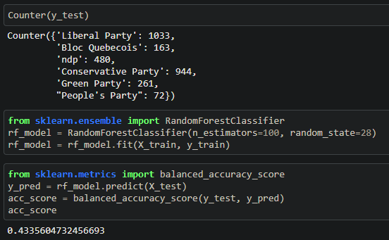
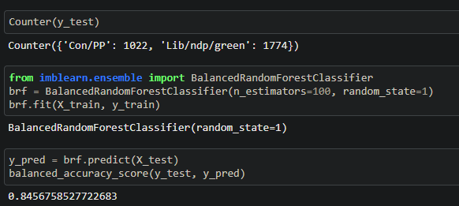

# Canadian Election Study Analysis

## Overview

Selected topic:
- Our topic is the 2019 Canadian Election Study, a large-scale survey measuring the attitudes of Canadians on important political, social, and economic issues before the most recent Federal election.

Reason for selection:
- It's a rich dataset with many angles for analysis and we had some people interested in exploring political ideas and why people vote for different parties based on their demographics and opinions.

Description of source data:
- It's a survey on the 2019 Federal election covering a multitude of topics potentially relevant. It's a mostly multiple choice survey with 37,822 responses.

Question we hope to answer:
- Predict party preference based on survey data

Description of Data Exploration and Analysis Phase
- Our analysis focuses on the demographic factors and issues that influenced Canadians' voting decisions in 2019. Because of this focus, some survey questions that are closely linked to political affiliation were dropped from the dataset--for example, questions about party ID, party membership, political donations, or opinions on party leaders were not included in the dataset used in our machine learning model. Additionally, some columns that had a large number of null values were dropped from the dataset. 
- Changed our focus from predicting the exact political party to predicting wether the person was left or right leaning in the political spectrum
- Our Machine Learning Model when predicting which political party you would vote for:

- Our Machine Learning accuracy when predicting if you leaned left or right on the political spectrum:

## Machine Learning Model

We will attempt to predict respondents' political party preferences based on their demographic information and their issue priorities. We plan to use a supervised machine learning model such as Random Forest or Ensemble Classifier to predict party preference.

## Database

The dataset is currently stored in a CSV file in the github repository. Data will be entered into a PostgreSQL database that will be connected to the final machine learning model.

## Dashboard

We are using a Tableau dashboard to display our results. Visualizations will have filters for party and region to easily display the shape of the Canadian electorate. (Note: the dashboard is currently in flux. Will be updated soon.)
